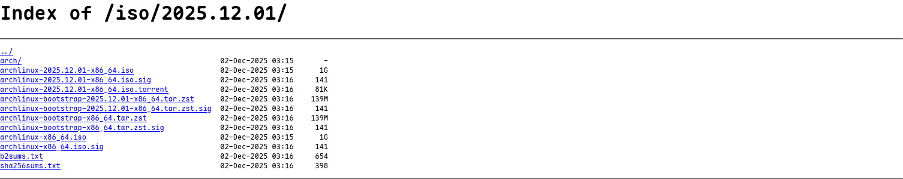
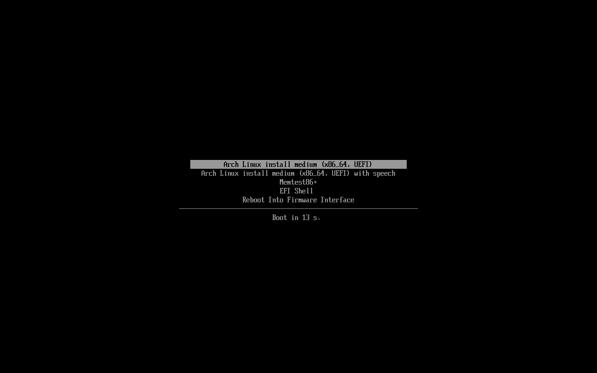
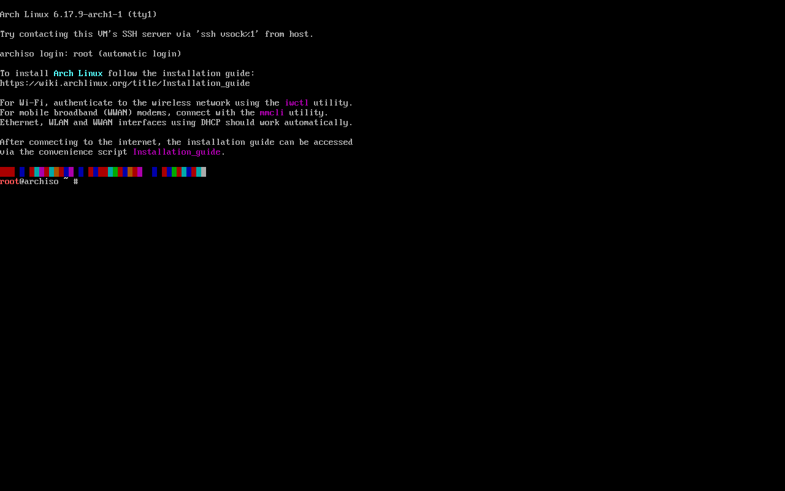

# Installing Linux

In this guide, I have chosen to install base Arch Linux. The following guides will assume that you are using Arch, but any Arch derivative should be able to follow the following guides too. If you aren't installing Arch, skip to the next guide [here](../part-2/en-US.md).

> [!IMPORTANT]
> Note: Commands prefixed with `#` should be run as root, and those prefixed with `$` should be run unprivileged.
>
> In the ISO, all commands are run as root as default.
>
> Lines prefixed with `//` are comments and should NOT be run.

Psst! Can't be bothered to manually install? Try the `archinstall` command after connecting to internet in the live environment, or maybe try an Arch derivative :3

# Downloading the ISO

First things first, we need to download the ISO file for Arch Linux. You can download it from [here](https://archlinux.org/download/).

Next, scroll down to the mirror lists:


Find your closest mirror, then click it.
You should be met with a page similar to this:

Select `archlinux-202x.xx.xx-x86_64.iso`.

# Preparing an installation medium

Next, we need to prepare something to boot from. I assume you don't have a CD, and I don't either, so we will use a USB drive.

1. Download [ventoy](https://www.ventoy.net/en/download.html).
2. Follow the instructions on the website to install ventoy.
3. Plug in your USB drive.
4. Open ventoy, select your USB drive, and install ventoy to the drive.
5. Drag and drop the downloaded ISO onto your USB drive

# Booting into the Arch live environment

Once you have flashed the USB, plug it into your computer and boot into the USB. You can do this by pressing the boot menu key on your computer. This is usually `F12` or `F2`, otherwise you can find your correct key [here](https://www.wikihow.com/Enter-BIOS)

When you boot into the USB you will be greeted with this screen:

Hit <ENTER> to continue. You should see something like this:


# Installing Arch Linux

> [!CAUTION]
> I recommend you follow the official installation guide [here](https://wiki.archlinux.org/title/Installation_guide), and research what options you want, but you can continue on if you just want to install. I will be picking options suitable for my hardware: 512GB nvme, Intel i7, Integrated graphics. Please do your own research and pick more sensible options if you have different hardware.

Also note that I have opinions, and the packages I install may not be the best for you.

## Connecting to the internet

This is much easier if you have ethernet. I don't, so I will be showing how to do it with wifi.

1. First, check your network interface:

```
# ip link
```

Look for `wlan0`.

2. Now we can use `iwctl` to connect.

```
# iwctl
// Scan for networks
  [iwd]# station wlan0 scan
  [iwd]# station wlan0 get-networks
// Select your wifi
  [iwd]# station wlan0 connect <YOUR WIFI NETWORK NAME>
  [iwd]# quit
```

3. Now, verify your connection:

```
# ping ping.archlinux.org
```

## Update system clock

```
# timedatectl
```

## Disk Setup

When recognised by the live system, disks are assigned to a block device such as `/dev/sda`, `/dev/nvme0n1` or `/dev/mmcblk0`.

> [!CAUTION]
> Partitioning should depend on your disk. Please don't blindly follow my steps, my setup is not optimal. See [here](https://wiki.archlinux.org/title/Installation_guide#Partition_the_disks). If you really just want to install, continue on.

1. Identify your block device:

```
# lsblk
```

For me, this will be `nvme0n1`

2. Now, to partition:

```
# fdisk /dev/nvme0n1
Command (m for help): g

Created a new GPT disklabel (GUID: BEBC11C7-507C-4D2D-A069-656DED1F8ECD).

Command (m for help): n
Partition number (1-128, default 1): 1
First sector (2048-1000215182, default 2048): 2048
Last sector, +/-sectors or +/-size{K,M,G,T,P} (2048-1000215182, default 1000214527): +1G

Created a new partition 1 of type 'Linux filesystem' and of size 1 GiB.

Command (m for help): t

Selected partition 1
Partition type or alias (type L to list all): uefi
Changed type of partition 'Linux filesystem' to 'EFI System'.

Command (m for help): n
Partition number (2-128, default 2): 2
First sector (2099200-1000215182, default 2099200): 2099200
Last sector, +/-sectors or +/-size{K,M,G,T,P} (2099200-1000215182, default 1000214527): 1000214527

Created a new partition 2 of type 'Linux filesystem' and of size 475.9 GiB.

Command (m for help): w
```

Our resulting partition table:
| Mount point on the installed system | Partition | Partition type |
| :---------------------------------: | :------------: | :-------------------: |
| /boot | /dev/nvme0n1p1 | EFI system partition |
| / | /dev/nvme0n1p2 | Linux x86-64 root (/) |

3. Now, we need to add filesystems:

Format the boot partition

```
# mkfs.fat -F 32 /dev/nvme0n1p1
```

Format our root partition. There are better filesystems, do your own research [here](https://wiki.archlinux.org/title/File_system) please!

```
# mkfs.ext4 /dev/nvme0n1p2
```

## Mounting partitions

We need to mount our partitions so we can actually do things.

```
# mount /dev/nvme0n1p2 /mnt
# mount --mkdir /dev/nvme0n1p1 /mnt/boot
```

## Installation

Now for the actual installation...

### 1. Select mirrors

Packages to be installed must be downloaded from mirror servers, which are defined in /etc/pacman.d/mirrorlist. The higher a mirror is placed in the list, the more priority it is given when downloading a package.

The topmost worldwide mirror should be fast enough for most people, but you may still want to inspect the file to see if it is satisfactory. If it is not, edit the file accordingly, and move the geographically closest mirrors to the top of the list, although other criteria should be taken into account.

This file will later be copied to the new system by pacstrap, so it is worth getting right.

```
# nano /etc/pacman.d/mirrorlist
// Make your changes
```

### 2. Install essential packages

> [!CAUTION]
> Please go [here](https://wiki.archlinux.org/title/Installation_guide#Install_essential_packages) and make sure the right packages for YOU are installed.

A base system:

```
# pacstrap -K /mnt base linux-firmware intel-ucode sudo fsck networkmanager nano man-db man-pages texinfo
```

### 3. fstab

To get needed file systems (like the one used for the boot directory /boot) mounted on startup, generate an fstab file. Use -U or -L to define by UUID or labels, respectively:

```
# genfstab -U /mnt >> /mnt/etc/fstab
```

Check the resulting /mnt/etc/fstab file, and edit it in case of errors.

### 4. chroot

To directly interact with the new system's environment, tools, and configurations for the next steps as if you were booted into it, change root into the new system:

```
# arch-chroot /mnt
```

### 5. Time

For human convenience (e.g. showing the correct local time or handling Daylight Saving Time), set the time zone:

```
# ln -sf /usr/share/zoneinfo/Australia/Sydney /etc/localtime
# hwclock --systohc
```

### 6. Localization

To use the correct region and language specific formatting (like dates, currency, decimal separators), edit /etc/locale.gen and uncomment the UTF-8 locales you will be using. Generate the locales by running:

```
# locale-gen
```

Create the `/etc/locale.conf` file, and set the LANG variable accordingly:

```
# nano /etc/locale.conf

LANG=en_US.UTF-8
```

### 7. Network configuration

To assign a consistent, identifiable name to your system (particularly useful in a networked environment), create the hostname file:

```
# echo "yourhostname" > /etc/hostname
```

Now, lets enable NetworkManager:

```
# systemctl enable NetworkManager
```

### 8. Bootloader

I opt for systemd-boot. You can find comparisons of some bootloaders [here](https://wiki.archlinux.org/title/Arch_boot_process#Feature_comparison).

```
# bootctl install
```

### 9. Root password

Set a secure password for the root user to allow performing administrative actions:

```
# passwd
```

### 10. Final configuration

#### 1. Create an user

> See [here](https://apple.stackexchange.com/questions/192365/is-it-ok-to-use-the-root-user-as-a-normal-user/192422#192422) for why you shouldn't stay logged in as root

Add an unprivileged user:

```
# useradd -m <yourusername>
```

Set a possword:

```
# passwd <yourusername>
```

Edit the `/etc/sudoers` file to allow yourself to use sudo:

```
# nano /etc/sudoers
```

Locate `# User priveilege specification`.

Add: `<yourusername> ALL=(ALL)`

#### 2. Audio

We will use pipewire:

```
# pacman -S wireplumber
```

Reboot, and log in to the user you created.

We will need to enable wireplumber:

```
$ systemctl --user enable wireplumber
```

#### 3. Shell Completions

Assuming you are using bash, install `bash-completion`:

```
# pacman -S bash-completion
```

Yippeee we now have a base system!

Click [here](../part-2/en-US.md) to advance to the next session.
