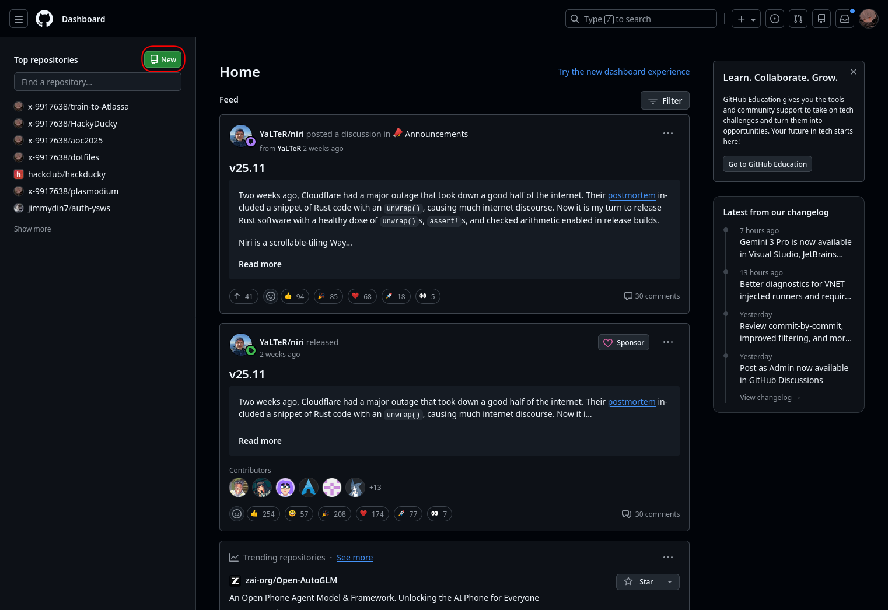
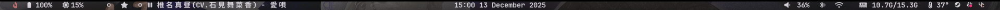

# Ricing your desktop
What even is ricing?

(Stolen off some website)
"Ricing is a term that has been used in the computer and technology world to describe the act of customizing the appearance of Linux. The term originated from the practice of modifying a car’s appearance, specifically by adding decorative features such as spoilers or other embellishments to make it look more appealing. Ricing involves making changes to the user interface, icons, themes, fonts, and other visual elements of Linux to give it a unique and personalised look."

# Getting Started
Because we are going to submit a git repo to riceathon, it's best to get organised before we start.

Create a new directory for your dotfiles:
```sh
mkdir -p ~/dotfiles
```
> [!IMPORTANT] 
> **What are dotfiles?**
> On linux, configuration files are usually stored in "dot"config (~/.config). 
> Dotfiles are these configuration files!

Create a GitHub repository:

```sh
cd ~/dotfiles
git init
git branch -M main
git remote add origin github_url
```

Now, we've set up our folder.

Whenever we want to add a configuration folder to this github repo, we can create a symbolic link:
```
sln ~/.config/FOLDER_OR_FILE ~/dotfiles/FOLDER_OR_FILE
```
> [!IMPORTANT] 
> **What is a symbolic link?**
> A symbolic link (symlink) is a pointer to another file or folder.
> So, if that file or folder changes, the symlinked contents also change!

# Ricing
When ricing, it is nice to set a color palette or a theme that you want to center your rice around. 

Alternatively, you can try color palette generators - see [matugen](https://github.com/InioX/matugen/wiki/Configuration), or just go crazy!

If you want inspiration, you can visit [r/unixporn](https://www.reddit.com/r/unixporn/), or look through [my old dotfiles](https://github.com/x-9917638/dotfiles)!

This guide will walk you through ricing a program that was installed in part 2, waybar :3

Our end result should look somewhat like this!


## Fonts
We've been using an ugly font this whole time ;-;

Lets spice it up!

The Arch wiki has a list of fonts [here](https://wiki.archlinux.org/title/Fonts#Font_packages), browse through them or search for a fun font!

Personally, I use [Maple Mono](https://github.com/subframe7536/Maple-font):
```sh
yay -S maplemononormal-nf-cn
```

Also, install a Nerd Font for icons:
```sh
pacman -S nerd-font
```
Pick your favourite! I use Jetbrains Mono (42) :3 

## Waybar

Waybar docs can be found [here](https://github.com/Alexays/Waybar/wiki)!

Make sure waybar is installed:
```sh
pacman -S waybar
```
Now, create the folders and files for waybar's config files:
```sh
mkdir -p ~/.config/waybar/{css,layouts}
touch ~/.config/waybar/{config.jsonc,modules.jsonc,style.css}
touch ~/.config/waybar/layouts/{with_music.jsonc,with_window.jsonc}
touch ~/.config/waybar/css/{style.css,colors.css}
```

> [!TIP]
> **What did we do?**
> 
> `mkdir` creates a directory. The `-p` option makes it create intermediate paths too! `touch` is a command that creates a file. 
>
> Whenever we use the `{}`, syntax, we are using **brace expansions**:
>
> > "Brace expansions are a mechanism to generate arbitrary strings sharing a common prefix and suffix, either of which can be empty"
>
> So:
> ```sh
> echo a{d,c,b}e
> # RESULT: ade ace abe
> ```

Remember to symlink the waybar folder!
```sh
sln ~/.config/waybar ~/dotfiles/waybar
```

Now that we have our proper file layout, let's open our editor and do some coding :3

To open Zed:
```sh
zeditor ~/.config/waybar
```

Make sure that Hackatime is working!

We've structured our waybar folder to be organised and modular:
```
~/.config/waybar/
├── config.jsonc
├── css
│   ├── colors.css
│   └── style.css
├── layouts
│   ├── with_music.jsonc
│   └── with_window.jsonc
├── modules.jsonc
└── style.css
```

Waybar has 2 files that must exist: config.jsonc, and style.css.

However, to make it easier to edit small things like modules or layout, we've separated out a `modules.jsonc` and a `layouts` folder.

Our top-level config.jsonc is simple, because all we do is import a layout.
Open the terminal from Zed (Ctrl + ~) and type:
```sh
echo '{ "include": [ "~/.config/waybar/layouts/with_music.jsonc" ] }' > config.jsonc
```

> [!TIP]
> **What did we do?**
> 
> `>` is a redirection operator. Here, we redirect the output of a command (`echo`) into a file (`config.jsonc`).

Next, lets make our modules. Open the `modules.jsonc` file in Zed.

Enter this in and look at the comments. Don't worry if the icons aren't visible on GitHub, as their font doesn't include the nerd font icons! Remember that you can customise things to suit you:
```json
// You can find icons using the nerd font cheat sheet: https://nerdfonts.com/cheat_sheet
{
  // Shows our workspaces!
  "niri/workspaces": {
    "format": "{icon}",
    "persistent-workspaces": { "*": 5 },
    "cursor": true,
    "format-icons": {
      // Our current workspace will be a star, workspaces with a window will be a filled dot
      // and empty workspaces will be empty dots!
      "active": "",
      "persistent": "",
      "empty": "",
    },
  },

  "niri/window": {
    "max-length": 45,
  },
  
  // A module for monitoring cpu usage
  "cpu": {
    // Polling interval, in ms
    "interval": 10,
    "format": " {usage}%",
    "states": {
      // Warning and critical change the class, which we can target in css.
      "warning": 80,
      "critical": 90,
    },
  },

  "tray": {
    "icon-size": 13,
    "spacing": 10,
    "cursor": true,
  },

  // cpu load
  "load": {
    "interval": 10,
    "format": " {load1}",
    "cursor": true,
  },

  "memory": {
    "interval": 10,
    "format": "  {used:0.1f}G/{total:0.1f}G",
    "states": {
      "warning": 80,
      "critical": 90,
    },
  },

  // cpu temperatures
  "temperature": {
    "interval": 10,
    "format": "{icon} {temperatureC}°",
    "critical-threshold": 90,
    "hwmon-path": "/sys/class/hwmon/hwmon3/temp1_input",
    // Icons will change depending on temperature's value!
    "format-icons": ["", "", "", "", ""],
  },

  "backlight": {
    "scroll-step": 2,
    "format": "{icon} {percent}%",
    "tooltip-format": "{percent}%",
    "format-icons": [
      "",
      "",
      "",
      "",
      "",
      "",
      "",
      "",
      "",
      "",
      "",
      "",
      "",
      "",
      "",
    ],
  },

  "wireplumber": {
    "format": "{icon}  {volume}%",
    "format-bluetooth": "{icon} {volume}%",
    // This will mute your volume
    "on-click": "pactl set-sink-mute @DEFAULT_SINK@ toggle",
    // Make sure you install pavucontrol!
    "on-click-right": "pavucontrol -t 4",
    // When scrolling, increase/decrease volume by 2
    "scroll-step": 2,
    "tooltip": true,
    "tooltip-format": "{volume}%",
    "format-muted": "{icon}",
    "format-icons": {
      "headphone": "",
      "headset": "",
      "headphone-muted": "󰟎",
      "headset-muted": "󰟎",
      "default": ["", ""],
      "default-muted": "󰖁",
    },
  },

  "network": {
    "interval": 10,
    "format-wifi": "  ",
    // Alt-format appears if you click the module.
    "format-alt": "   {frequency}Ghz ({essid}) | {signalStrength}%",
    "format-disconnected": "",
  },

  "bluetooth": {
    "format": "{}",
    "format-on": "󰂰",
    "format-off": "󰂲",
    "format-disabled": "󰂲",
    "tooltip-format": "{device_enumerate}",
    "tooltip-format-enumerate-connected": "{device_alias}",
    "tooltip-format-enumerate-connected-battery": "{device_alias}\t {device_battery_percentage}%",
    "on-click-right": "blueman-manager",
  },

  "battery": {
    "interval": 20,
    "full-at": 100,
    "tooltip": true,
    "format": "{icon} {capacity}%",
    "format-time": "{H}:{M:02}",
    "format-charging": " {capacity}% ({time})",
    "format-icons": ["󰁺", "󰁻", "󰁼", "󰁽", "󰁾", "󰁿", "󰂀", "󰂂", "󰁹"],
    "states": {
      "warning": 30,
      "critical": 15,
    },
  },

  "clock": {
    "tooltip-format": "<tt><small>{calendar}</small></tt>",
    "format-alt": "{:%H:%M %d %B %Y}",
    // You can have arbitrary commands to be execute on click and on right click
    "on-click-right": "kitty --app-id 'float-tty-clock' -e tty-clock -c",
    "calendar": {
      "mode": "month",
      "format": {
        "months": "<b>{}</b>",
        "days": "<span color='#acb0d0'><b>{}</b></span>",
        "today": "<span color='#41a6b5'><b><u>{}</u></b></span>",
      },
    },
  },
  
  // mpris is a interface that lets programs poll playing media
  "mpris": {
    "format": "{artist} - {title}",
    "tooltip-format": "{album}",
    "format-paused": " {artist} - {title}",
    "on-click": "playerctl play-pause",
    "on-scroll-up": "playerctl previous",
    "on-scroll-down": "playerctl next",
    "max-length": 45,
  },

  "power-profiles-daemon": {
    "format": "{icon}",
    "tooltip-format": "Power profile: {profile}",
    "format-icons": {
      "performance": "",
      "balanced": " ",
      "power-saver": "󰂄",
    },
  },
}
```

Yippee! We finished our waybar modules!

Now it's time for the layout.

Open `layouts/with_music.jsonc` in Zed. Enter this:
```json
{
  "layer": "bottom",
  "position": "top",
  "margin": "0 0 0 0",
  "reload_style_on_change": true,

  // We group modules for better organisation
  "group/gleft1": {
    "orientation": "horizontal",
    "modules": ["battery", "cpu"],
  },

  "group/gleft2": {
    "orientation": "horizontal",
    "modules": ["niri/workspaces", "mpris"],
  },

  "group/gright1": {
    "orientation": "horizontal",
    "modules": ["memory", "temperature", "tray"],
  },

  "group/gright2": {
    "orientation": "horizontal",
    "modules": ["wireplumber", "bluetooth", "network"],
  },

  "modules-left": ["power-profiles-daemon", "group/gleft1", "group/gleft2"],
  "modules-center": ["clock"],
  "modules-right": ["group/gright2", "group/gright1"],

  // We need to include our modules to use them here.
  "include": ["~/.config/waybar/modules.jsonc"],
}
```
Done! Optionally, you can place this into `layouts/with_window.jsonc`:
```json
{
  "layer": "top",
  "position": "top",
  "width": 1920,
  "margin": "5 0",

  "group/gleft1": {
    "orientation": "horizontal",
    "modules": ["battery", "cpu", "backlight"],
  },

  "group/gleft2": {
    "orientation": "horizontal",
    "modules": ["niri/workspaces", "niri/window"],
  },

  "group/gright1": {
    "orientation": "horizontal",
    "modules": ["memory", "temperature", "tray"],
  },

  "group/gright2": {
    "orientation": "horizontal",
    "modules": ["wireplumber", "bluetooth", "network"],
  },

  "modules-left": ["power-profiles-daemon", "group/gleft1", "group/gleft2"],
  "modules-center": ["clock"],
  "modules-right": ["group/gright2", "group/gright1", "custom/ctlcenter"],

  "include": ["~/.config/waybar/modules.jsonc"],
}
```
Now that we've finished defining our layouts and modules, we can work on our styles.

Like `config.jsonc`, our top level `style.css` is a simple 1 line import:
```sh
echo '@import "css/style.css";' > style.css
```

Now we can run `waybar` and see our edits live!

In Zed, open `css/colors.css`. Here, we define our colour palette! Here are mine:

```css
/* 
Define your background, foreground, inactive colour 
(Lowkey doesn't have a big difference 
*/
@define-color background rgba(20, 19, 24, 0.5);
@define-color tooltip-bg @background;
@define-color module-bg @background;
@define-color inactive rgb(230, 225, 233);
@define-color fg rgb(230, 225, 233);
@define-color workspace-fg @fg;

/* You should copy these colours though! */
@define-color red #c87878;
@define-color blue #7878c8;
@define-color yellow #c8c878;
@define-color green #78c878;
```

Now, we can edit our styles. Open `css/style.css` in Zed and enter this:
```css
/* Import our color palette */
@import "colors.css";

* {
    /* Your Nerd Font */
    font-family: "JetBrains Mono Nerd Font";
    border: none;
    border-radius: 0;
    min-height: 0;
    margin: 0;
    padding: 0;
    text-shadow: none;
}

#waybar {
    font-weight: 700;
    background: rgba(0, 0, 0, 0.2);
    font-size: 14px;
    border-radius: 15px;
    color: @fg;
    padding: 0 15px;
}

.modules-left,
.modules-center,
.modules-right {
    margin-bottom: -10px;
    margin-top: -10px;
    margin-left: 10px;
    margin-right: 10px;
    padding: 10px;
}

tooltip {
    padding: 8px;
    border-radius: 15px;
    background: transparent;
}

tooltip label {
    padding: 8px;
    font-weight: bold;
}

.popup * {
    box-shadow: none;
    outline: none;
}

#tray menu,
menu {
    border-radius: 10px;
    font-weight: 700;
    color: @fg;
}

#tray menu > *,
menu > * {
    padding: 0 0;
}

#tray menu > *:hover,
menu > *:hover {
    border-radius: 10px;
    background-color: @inactive;
}

/* global paddings */
#backlight,
#wireplumber,
#network,
#temperature,
#bluetooth,
#battery,
#memory,
#cpu,
#load {
    padding: 0 7px;
}

#workspaces,
#bluetooth,
#battery,
#memory,
#temperature,
#network,
#wireplumber,
#backlight,
#cpu,
#load {
    background: transparent;
    border-radius: 15px;
    margin: 0 3px;
}

#network {
    padding: 0;
}

#custom-start,
#custom-logout,
#gright1,
#gleft1,
#gright2,
#gleft2,
#custom-ctlcenter,
#power-profiles-daemon {
    padding: 0 9px;
    border-radius: 15px;
    background: transparent;
}

#clock {
    padding: 0;
    border-radius: 15px;
    background: transparent;
}

/* single icons cool size  */

#gright2,
#gleft2 {
    margin: 0;
}

#gleft1 {
    margin: 0;
}

#gright1 {
    margin: 0;
}

#memory.critical,
#cpu.critical,
#temperature.critical,
#battery.critical,
#network.disconnected {
    color: @red;
}

#memory.warning,
#cpu.warning,
#temperature.warning,
#battery.warning {
    color: @yellow;
}

#workspaces button {
    color: @workspace-fg;
    font-size: 14px;
    border-radius: 15px;
    margin: 0 7px;
}

#workspaces button:hover {
    background: rgba(0, 0, 0, 0);
}

#mpris,
#window {
    margin: 0;
}

#mpris.paused {
    color: @inactive;
}

#power-profiles-daemon {
    margin-left: 5px;
    padding: 0;
}

#power-profiles-daemon.performance {
    color: @red;
}

#power-profiles-daemon.power-saver {
    color: @green;
}
```

# End
Yippeee! You've reached the end of the guide!

## What's next?
Make all your other programs look nice :3

This could include:
- Compositor
- Terminal Emulator
- App Launcher
- etc!

## Helpful Resources

- [r/unixporn](https://www.reddit.com/r/unixporn/) - This is the biggest online community for ricing! Go here for inspiration.
- [Arch Wiki](https://wiki.archlinux.org) - The Arch Linux wiki is incredibly helpful for everything related to Linux, with helpful information on tons of software.
- [awesome-ricing](https://github.com/fosslife/awesome-ricing) - A massive open-source list of ricing/Linux tools and software from window managers, to terminals, to colour schemes, to even wallpapers.
