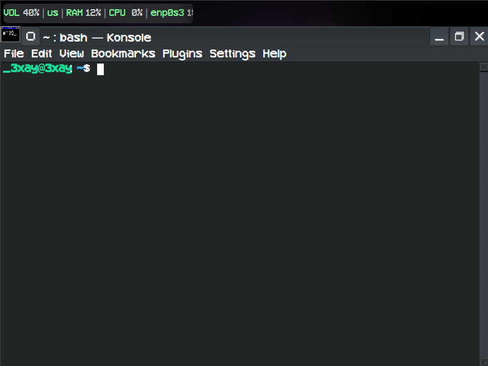
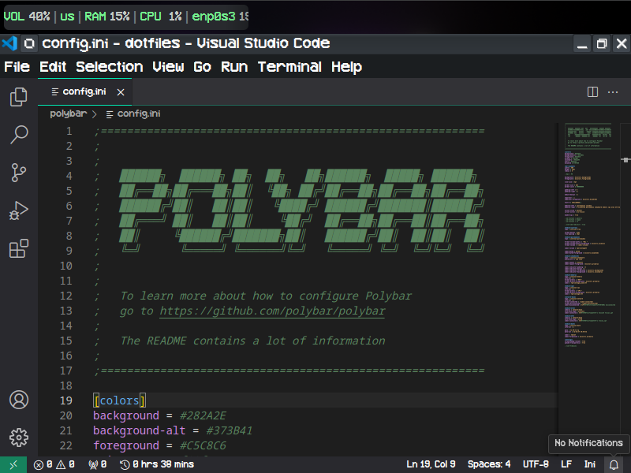

# Retro 3XAY
A retro-themed rice for KDE Plasma desktop environements. It's designed to be minimalistic with a retro theme and green accents.
The wallpaper is a custom wallpaper made by me (3XAY) in Blender. Although it doesn't match the retro-minimalistic aesthetic as much, it's
a personal touch and fits the programming theme. This also uses polybar and a auto-hide taskbar to show you the most important info at a glance.
This was made for a YSWS by Hack Club, and took ~4-5 hours (only counted 2 hours of Hackatime because that's how long it took me to change the grub and polybar).

